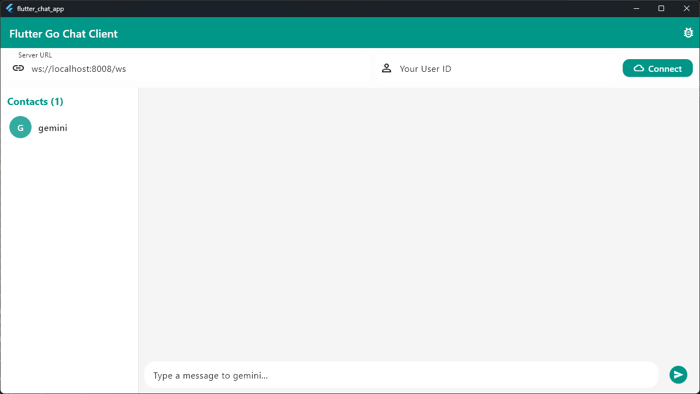

# Go-C#/Flutter WebSocket Chat Application

[中文版](README_zh.md)

## Project Introduction

This is a WebSocket chat application built with a Go backend and two alternative frontends: C# MAUI Blazor and Flutter. The application supports real-time messaging, dynamic user list updates, broadcast messages, and AI-powered chat via the Gemini API. It is designed for learning purposes and as a template for small-scale chat applications.

------

## Project Screenshots

### Flutter Chat Interface





#### Communication with Gemini： 


### C# Blazor Hybrid Chat Interface


### Backend Logs

- Logs for user connections, disconnections, and message forwarding.

------

## Features

1.  **Dual Chat Modes**: Seamlessly switch between chatting with online users and conversing with the Gemini AI (Flutter).
2.  **Real-time Messaging**: Enables users to send and receive messages in real time.
3.  **Gemini AI Integration**: Engage in intelligent, human-like conversations with Google's Gemini model.
4.  **Dynamic User List**: Displays active users, automatically updated when users join or leave.
5.  **Cross-Platform**: Choose between a C# MAUI Blazor hybrid app or a Flutter app, both capable of running on multiple platforms.
6.  **Avatar Management**: Allows users to customize their avatars, with updates @visible to others in real time (C#).
7.  **Message Storage**: The frontend stores chat history for users to view past conversations.
8.  **Broadcast Messages**: Admins can send global broadcast messages via the backend terminal.

------

## Usage

### Prerequisites

1.  Install the latest version of Go.
2.  Install the Flutter SDK and/or .NET 8.0.
3.  A Google Gemini API Key: [Get API Key](https://aistudio.google.com/app/apikey) (required for AI chat features).

------

### Quick Start

#### 1. Backend Setup

First, get the backend server running.

1.  Navigate to the backend directory:
    ```bash
    cd GoChatServer
    ```
2.  Start the Go service:
    ```bash
    go run main.go
    ```
3.  The WebSocket service will run at `ws://localhost:8008/ws`.

---

#### 2. Frontend Setup

Choose one of the frontend applications to run.

##### Option A: Flutter Frontend

1.  **API Key Setup (Important!)**
    This application loads the Gemini API key from a local file.
    -   **On Windows:**
        1.  Open your `Documents` folder (e.g., `C:\Users\YourUsername\Documents`).
        2.  Create a new text file named `Gemini的api key.txt`.
        3.  Paste your Gemini API key into this file and save it.
    -   **On macOS/Linux:**
        You will need to modify the `_initialize` method in `lib/providers/chat_provider.dart` to point to a valid file path on your system.

2.  **Run the App**
    ```bash
    # Navigate to the Flutter app directory
    cd flutter_chat_app

    # Install dependencies
    flutter pub get

    # Run the app (e.g., on Windows desktop)
    flutter run -d windows
    ```
3.  **Connect**
    -   In the app, keep the default server URL (`ws://localhost:8008/ws`).
    -   Enter a unique User ID and click **Connect**.
    -   Select "gemini" to chat with the AI, or select another user.

##### Option B: C# MAUI Blazor Frontend

1.  **Install MAUI Workload**
    ```bash
    dotnet workload install maui
    ```
2.  **Run the App**
    ```bash
    # Navigate to the C# app directory
    cd ChatApp

    # Restore dependencies
    dotnet restore

    # Run the project
    dotnet build -t:Run -f net8.0-windows10.0.19041.0
    ```
    Alternatively, open the `ChatApp.sln` in Visual Studio or VS Code with the C# and .NET MAUI extensions and run it from there.

------

## Project Structure

#### Backend (`GoChatServer/`)

-   `main.go`: Handles WebSocket connections, message broadcasting, and user management using the `gorilla/websocket` library.

#### Frontend (`flutter_chat_app/`)

-   `lib/`: Contains the core Dart code for the Flutter application.
-   `lib/providers/chat_provider.dart`: Manages state, WebSocket connection, and Gemini API calls.
-   `lib/screens/chat_screen.dart`: The main UI for the chat interface.
-   `pubspec.yaml`: Defines project dependencies.

#### Frontend (`ChatApp/`)

-   `Components/Pages/`: Contains the main Razor components for the UI.
-   `Services/ChatService.cs`: Handles the WebSocket client logic.
-   `MauiProgram.cs`: Configures the .NET MAUI application and services.

## Project Dependencies

#### Backend (Go)

-   `github.com/gorilla/websocket`: For WebSocket functionality.

#### Frontend (Flutter)

-   `provider`: For state management.
-   `web_socket_channel`: For WebSocket communication.
-   `http`: For making requests to the Gemini API.
-   `intl`: For date formatting.

#### Frontend (C#)

-   `MudBlazor`: For a modern UI component library.
-   `.NET WebSocket`: For native WebSocket communication.

------

## Contribution Guide

We welcome suggestions and code contributions to this project:

1.  Fork the repository.
2.  Create a feature branch: `git checkout -b feature/<your-feature>`
3.  Commit your changes and submit a Pull Request.

------

## License

This project is licensed under the MIT License.
