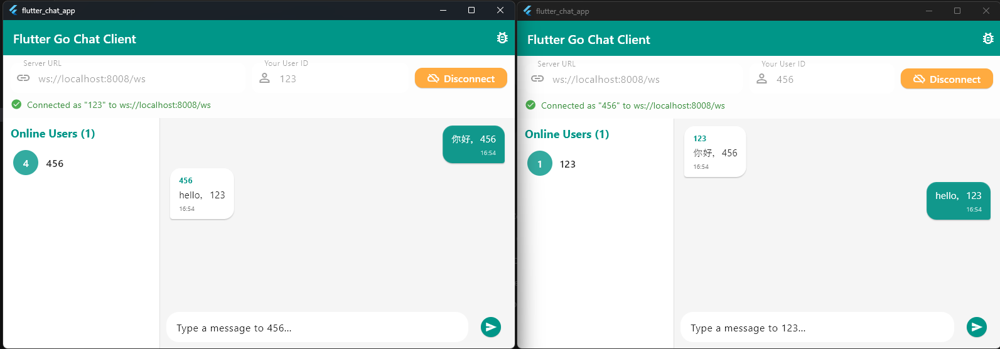
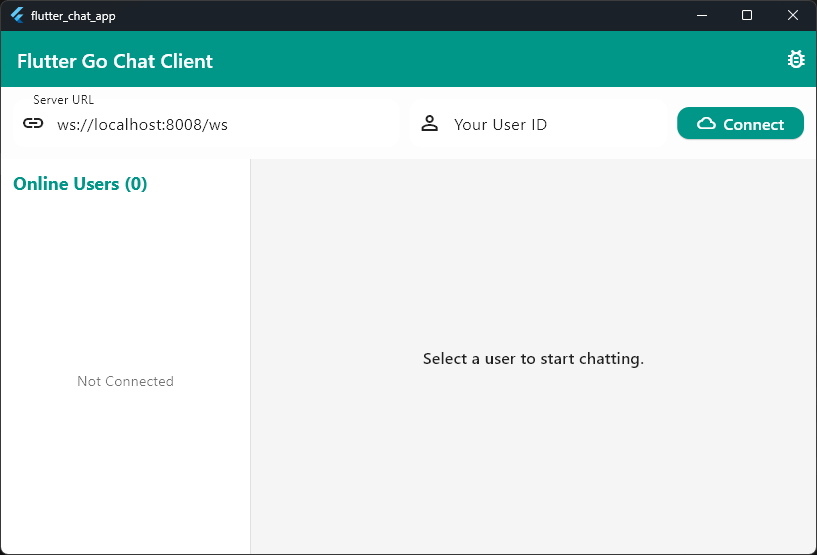
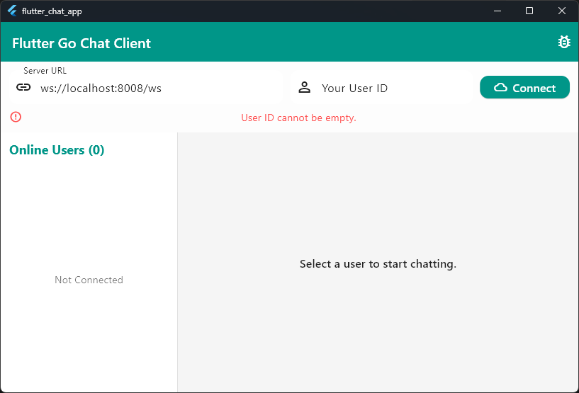
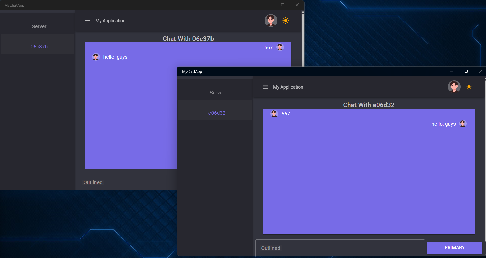
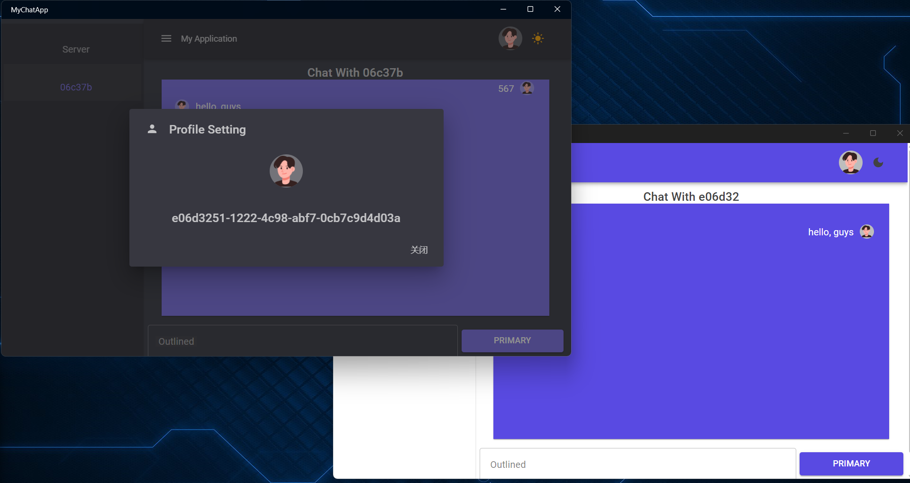
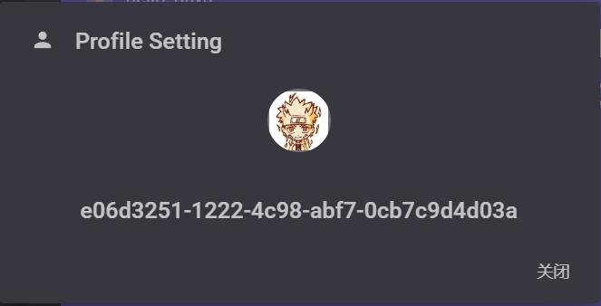
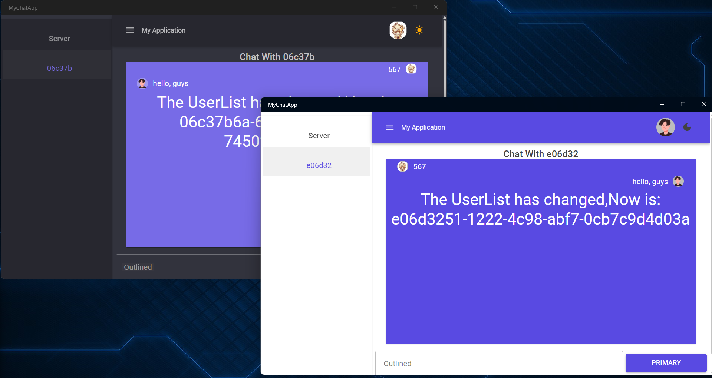

# Go-C#/flutter WebSocket 聊天应用

[中文版](README_zh.md)

## 项目介绍

这是一个使用 Go 和 C# 构建的 WebSocket 聊天应用。后端使用 Go 提供 WebSocket 服务，前端则利用 Flutter 或 Maui Blazor 混合框架打造现代化的用户界面。该应用支持实时消息传递、动态用户列表更新和广播消息。它通过 WebSocket 实现双向通信，适合用于学习和小型聊天应用。

------

## 项目截图

### Flutter 聊天界面





### Csharp 的 Blazor 混合聊天界面







### 后端日志

- 用户连接、断开连接和消息转发的日志。

-----

## 功能

1. **实时消息**：允许用户实时发送和接收消息。
2. **广播消息**：管理员可以通过终端发送全局广播消息。
3. **动态用户列表**：显示活跃用户，并在用户加入或离开时自动更新。
4. **头像管理**：允许用户自定义头像，并实时向其他人显示更新。
5. **消息存储**：前端存储聊天记录，方便用户查看过去的对话。

------

## 使用方法

### 先决条件

1. 安装最新版本的 Go。
2. 安装 .NET 9.0 或 Flutter。
3. 确保有 `curl` 或其他工具可用于测试 WebSocket 服务。

------

### 快速入门
如果您使用 Flutter GUI，请打开 `flutter_chat_app`，否则请打开 `ChatApp`。

#### 安装 Flutter
安装非常简单。

#### 安装 MAUI 工作负载

运行以下命令：

```bash
dotnet 工作负载安装 maui
```

#### 设置开发环境

在 `VSCode` 中打开项目并安装以下扩展：

- `.NET 安装工具`
- `.NET MAUI`
- `C#`
- `Go`
- `flutter`

------

#### 后端

1. 导航到后端目录 `GoChatServer`。

2. 运行以下命令启动 Go 服务：

```bash
go run main.go
```

3. WebSocket 服务将在 `http://localhost:8008/ws` 运行。

------

#### 前端
如果您使用 Flutter：
1. 导航到前端目录 `flutter_chat_app`。
2. 运行
```bash
flutter run -d windows
```

如果您使用 Csharp Blazor Hybrid：
1. 导航到前端目录 `MyChatApp`。

2. 恢复项目依赖项：

```bash
dotnet restore
```

3. 打开 `MauiProgram.cs` 文件。您应该看到类似以下内容：


- 点击底部的 `Debug Target`。
- 点击“Run”按钮运行项目。

------

### 附加说明

建议修改 `MyChatApp\Components\Layout\ProfilePopover.razor` 中图片的保存位置。目前，图片保存在项目运行时目录中。对于生产环境，请考虑使用第三方托管服务。
主要应用程序逻辑位于 `MyChatApp\Components\Pages` 中。

## 项目结构

### 后端 (Go)

- 提供 WebSocket 服务并监听 `8008` 端口。
- 管理用户连接、消息转发、用户列表广播和断开连接。
- 使用 `gorilla/websocket` 库构建，用于 WebSocket 通信。

关键文件和函数：

- `main.go`：处理用户管理和消息处理的主程序。

### 前端 (C#)

- 使用 Maui Blazor 混合框架和 MudBlazor 框架构建，提供现代化的聊天界面。
- 连接到后端 WebSocket 服务进行实时通信。
- 支持显示各种消息类型，包括系统消息和用户消息。

关键文件和函数：

- `Chat.razor`：聊天界面组件，负责渲染聊天窗口和用户消息。
- `ChatService.cs`：与后端 WebSocket 服务通信的逻辑。

## 项目依赖项

### 后端依赖项

- `github.com/gorilla/websocket`：用于 WebSocket 功能。

### 前端依赖项

- `MudBlazor`：用于创建现代化的 UI。
- `.NET WebSocket`：用于后端通信。

------

## 贡献指南

我们欢迎您为本项目提供建议和代码贡献：

1. fork 代码库。

2. 创建功能分支：

```bash
git checkout -b feature/<your-feature>
```

3. 提交您的更改并提交拉取请求。

------

## 许可证

本项目采用 MIT 许可证。