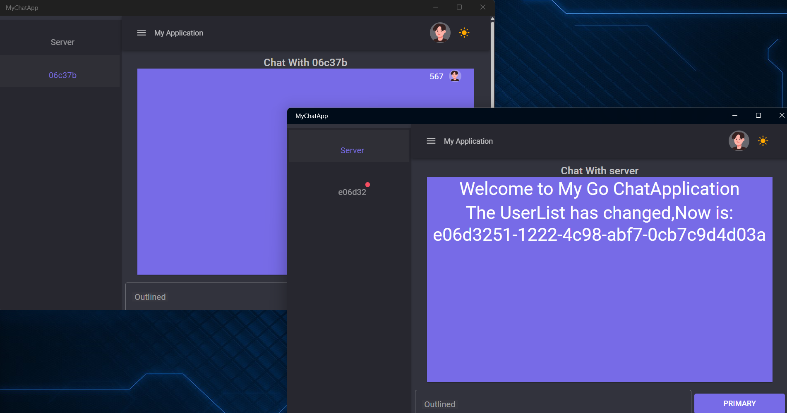

# Go-C#/Flutter WebSocket 聊天应用

[English Version](README.md)

## 项目介绍

这是一个 WebSocket 聊天应用，后端使用 Go 构建，并提供两个可选的前端：C# MAUI Blazor 和 Flutter。该应用支持实时消息传递、动态用户列表更新、广播消息以及通过 Gemini API 实现的 AI 聊天功能。本项目旨在用于学习目的，并可作为小型聊天应用的模板。

------

## 项目截图

### Flutter 聊天界面


#### 与 Gemini 通信：


### C# Blazor Hybrid 聊天界面




### 后端日志

- 记录用户连接、断开连接和消息转发的日志。

------

## 功能

1.  **双重聊天模式**：在与在线用户聊天和与 Gemini AI 对话之间无缝切换 (Flutter)。
2.  **实时消息**：允许用户实时发送和接收消息。
3.  **Gemini AI 集成**：与 Google 的 Gemini 模型进行智能、类似人类的对话。
4.  **动态用户列表**：显示活跃用户，当用户加入或离开时自动更新。
5.  **跨平台**：可选择 C# MAUI Blazor 混合应用或 Flutter 应用，两者都能在多个平台上运行。
6.  **头像管理**：允许用户自定义头像，更新后可被其他用户实时看到 (C#)。
7.  **消息存储**：前端存储聊天记录，方便用户查看过去的对话。
8.  **广播消息**：管理员可以通过后端终端发送全局广播消息。

------

## 使用方法

### 先决条件

1.  安装最新版本的 Go。
2.  安装 Flutter SDK 和/或 .NET 8.0。
3.  一个 Google Gemini API 密钥：[获取 API 密钥](https://aistudio.google.com/app/apikey) (AI 聊天功能需要)。

------

### 快速入门

#### 1. 后端设置

首先，运行后端服务器。

1.  导航到后端目录：
    ```bash
    cd GoChatServer
    ```
2.  启动 Go 服务：
    ```bash
    go run main.go
    ```
3.  WebSocket 服务将在 `ws://localhost:8008/ws` 运行。

---

#### 2. 前端设置

选择一个前端应用来运行。

##### 选项 A: Flutter 前端

1.  **API 密钥设置 (重要!)**
    此应用从本地文件加载 Gemini API 密钥。
    -   **在 Windows 上:**
        1.  打开您的 `文档` 文件夹 (例如, `C:\Users\YourUsername\Documents`)。
        2.  创建一个名为 `Gemini的api key.txt` 的新文本文件。
        3.  将您的 Gemini API 密钥粘贴到此文件中并保存。
    -   **在 macOS/Linux 上:**
        您需要修改 `lib/providers/chat_provider.dart` 中的 `_initialize` 方法，使其指向您系统上的有效文件路径。

2.  **运行应用**
    ```bash
    # 导航到 Flutter 应用目录
    cd flutter_chat_app

    # 安装依赖
    flutter pub get

    # 运行应用 (例如, 在 Windows 桌面)
    flutter run -d windows
    ```
3.  **连接**
    -   在应用中，保留默认的服务器 URL (`ws://localhost:8008/ws`)。
    -   输入一个唯一的用户 ID，然后点击 **Connect**。
    -   选择 "gemini" 与 AI 聊天，或选择其他用户。

##### 选项 B: C# MAUI Blazor 前端

1.  **安装 MAUI 工作负载**
    ```bash
    dotnet workload install maui
    ```
2.  **运行应用**
    ```bash
    # 导航到 C# 应用目录
    cd ChatApp

    # 恢复依赖
    dotnet restore

    # 运行项目
    dotnet build -t:Run -f net8.0-windows10.0.19041.0
    ```
    或者，在 Visual Studio 或装有 C# 和 .NET MAUI 扩展的 VS Code 中打开 `ChatApp.sln` 并从那里运行。

------

## 项目结构

#### 后端 (`GoChatServer/`)

-   `main.go`: 使用 `gorilla/websocket` 库处理 WebSocket 连接、消息广播和用户管理。

#### 前端 (`flutter_chat_app/`)

-   `lib/`: 包含 Flutter 应用的核心 Dart 代码。
-   `lib/providers/chat_provider.dart`: 管理状态、WebSocket 连接和 Gemini API 调用。
-   `lib/screens/chat_screen.dart`: 聊天界面的主 UI。
-   `pubspec.yaml`: 定义项目依赖。

#### 前端 (`ChatApp/`)

-   `Components/Pages/`: 包含 UI 的主要 Razor 组件。
-   `Services/ChatService.cs`: 处理 WebSocket 客户端逻辑。
-   `MauiProgram.cs`: 配置 .NET MAUI 应用和服务。

## 项目依赖

#### 后端 (Go)

-   `github.com/gorilla/websocket`: 用于 WebSocket 功能。

#### 前端 (Flutter)

-   `provider`: 用于状态管理。
-   `web_socket_channel`: 用于 WebSocket 通信。
-   `http`: 用于向 Gemini API 发出请求。
-   `intl`: 用于日期格式化。

#### 前端 (C#)

-   `MudBlazor`: 用于现代化的 UI 组件库。
-   `.NET WebSocket`: 用于原生的 WebSocket 通信。

------

## 贡献指南

我们欢迎对此项目的建议和代码贡献：

1.  Fork 本仓库。
2.  创建一个功能分支: `git checkout -b feature/<your-feature>`
3.  提交您的更改并提交一个拉取请求 (Pull Request)。

------

## 许可证

本项目采用 MIT 许可证。
